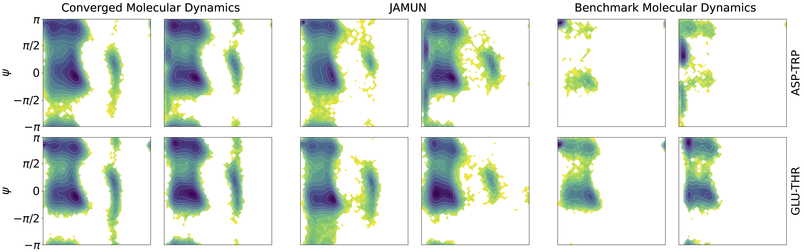

# JAMUN: Transferable Molecular Conformational Ensemble Generation with Walk-Jump Sampling

This is the official implementation of the paper
[JAMUN: Transferable Molecular Conformational Ensemble Generation with Walk-Jump Sampling](https://arxiv.org/abs/2410.14621v1).



Conformational ensembles of protein structures are immensely important both to understanding protein function, and for drug discovery in novel modalities such as cryptic pockets. Current techniques for sampling ensembles are computationally inefficient, or do not transfer to systems outside their training data. We present walk-Jump Accelerated Molecular ensembles with Universal Noise (JAMUN), a step towards the goal of efficiently sampling the Boltzmann distribution of arbitrary proteins. By extending Walk-Jump Sampling to point clouds, JAMUN enables ensemble generation at orders of magnitude faster rates than traditional molecular dynamics or state-of-the-art ML methods. Further, JAMUN is able to predict the stable basins of small peptides that were not seen during training.

<p align="center">
  
</p>

## Setup

Clone the repository with HTTPS:
```bash
git clone https://github.com/prescient-design/jamun.git
```
or SSH:
```bash
git clone git@github.com:prescient-design/jamun.git
```

Navigate to the cloned repository:
```bash
cd jamun
```

### Setup with `uv`

We recommend using [`uv`](https://docs.astral.sh/uv/getting-started/installation/).

Create a virtual enviroment:
```bash
uv venv --python 3.11
source .venv/bin/activate
```

Then, install all dependencies:
```bash
uv pip install -r env/linux-cuda/requirements.txt
uv pip install -e .[dev]
```

### Setup with `mamba` or `conda`

Alternatively, you can install
[`mamba`](https://github.com/conda-forge/miniforge?tab=readme-ov-file#install) or [`conda`](https://github.com/conda-forge/miniforge?tab=readme-ov-file#install).

Create an environment:
```bash
mamba create -n jamun-env python=3.11 -y
mamba activate jamun-env
```

Then, install all dependencies:
```bash
pip install -r env/linux-cuda/requirements.txt
pip install -e .[dev]
```

## Data

The uncapped 2AA data from [Timewarp](https://arxiv.org/abs/2302.01170) can be obtained from [Hugging Face](https://huggingface.co/datasets/microsoft/timewarp).

```bash
cd /path/to/data/root/
git lfs install
git clone https://huggingface.co/datasets/microsoft/timewarp
```
where `/path/to/data/root/` is the path where you want to store the datasets.

This should be your directory structure:
```bash
/path/to/data/root/
└── timewarp/
    ├── 2AA-1-big/
    │   └── ...
    ├── 2AA-1-large/
    │   └── ...
```
Now, you have have two options for JAMUN to find the data directory:
- Set the environment variable `JAMUN_DATA_PATH`:
```bash
export JAMUN_DATA_PATH=/path/to/data/root/
```

- or, create a `.env` file and set `JAMUN_DATA_PATH`:
```
JAMUN_DATA_PATH=/path/to/data/root/
```

## Training

Once you have downloaded the data and set the appropriate data variables correctly, 
you can start training on Timewarp.

We recommend first running our test config to check that installation was successful:
```
jamun_train --config-dir=configs experiment=train_test.yaml
```

Then, you can train on the uncapped 2AA peptides dataset:

```bash
jamun_train --config-dir=configs experiment=train_uncapped_2AA.yaml
```

or the uncapped 4AA peptides dataset:

```bash
jamun_train --config-dir=configs experiment=train_uncapped_4AA.yaml
```

By default, all run outputs will be saved to `outputs` in the current directory.

We also provide sample SLURM scripts for training on clusters in `slurm`[(figures/jamun-results.png)]

## Inference

To sample conformations from the test set peptides once you have a trained model,
either specify the `wandb_train_run_path` (obtainable from the Weights and Biases UI for your training run):

<p align="center">
  
</p>

and start sampling with:

```bash
jamun_sample --config-dir=configs experiment=sample_uncapped_2AA.yaml wandb_train_run_path=...
```

Alternatively, you can specify the `checkpoint_dir` of the trained model:

```bash
jamun_sample --config-dir=configs experiment=sample_uncapped_2AA.yaml checkpoint_dir=...
```

If you want to sample conformations for a particular protein sequence:
```bash

```

We provide trained weights at ...

## Citation

If this repository was useful to you, please cite our preprint!

```bibtex
@misc{daigavane2024jamuntransferablemolecularconformational,
      title={JAMUN: Transferable Molecular Conformational Ensemble Generation with Walk-Jump Sampling}, 
      author={Ameya Daigavane and Bodhi P. Vani and Saeed Saremi and Joseph Kleinhenz and Joshua Rackers},
      year={2024},
      eprint={2410.14621},
      archivePrefix={arXiv},
      primaryClass={physics.bio-ph},
      url={https://arxiv.org/abs/2410.14621}, 
}
```