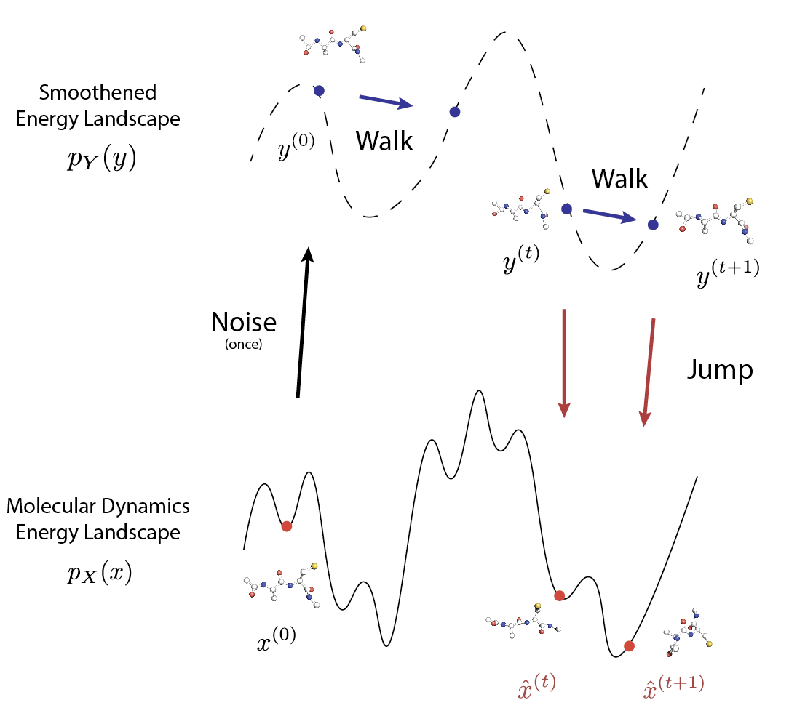

# JAMUN: Transferable Molecular Conformational Ensemble Generation with Walk-Jump Sampling

This is the official implementation of the paper
[JAMUN: Transferable Molecular Conformational Ensemble Generation with Walk-Jump Sampling](https://arxiv.org/abs/2410.14621v1).





## Setup

Clone the repository (either HTTPS or SSH):
```bash
# HTTPS
git clone https://github.com/prescient-design/jamun.git
# or SSH:
git clone git@github.com:prescient-design/jamun.git
```

We recommend creating either a `mamba` or a `conda` environment:
```bash
mamba create -n jamun python=3.11 -y
mamba activate jamun
```

Then, install all dependencies:
```bash
pip install -r env/linux-cuda/requirements.txt
pip install -e .[dev]
```

## Data

The uncapped 2AA data from [Timewarp](https://arxiv.org/abs/2302.01170) can be obtained from [Hugging Face](https://huggingface.co/datasets/microsoft/timewarp).

If this is your directory structure for your data:
```bash
/path/to/data/root/
└── timewarp/
    ├── 2AA-1-big/
    │   └── ...
    ├── 2AA-1-large/
    │   └── ...
```
you have three options for JAMUN to find the right folder:
- Set the environment variable `JAMUN_DATA_PATH` to point to the directory containing `timewarp`:
```bash
export JAMUN_DATA_PATH=/path/to/data/root/
```

- Override `paths.data_path` in the command-line:
```bash
jamun_train --config-dir=configs experiment=train_uncapped_2AA.yaml  paths.data_path=/path/to/data/root

jamun_sample --config-dir=configs experiment=sample_uncapped_2AA.yaml  paths.data_path=/path/to/data/root
```

- Change the `paths.data_path` in the actual [hydra config](https://github.com/prescient-design/jamun/blob/main/src/jamun/hydra_config/paths/default.yaml).


## Training

Once you have set the data directory variables correctly,
you can start training on 2AA peptides:

```bash
jamun_train --config-dir=configs experiment=train_uncapped_2AA.yaml
```

or 4AA peptides:

```bash
jamun_train --config-dir=configs experiment=train_uncapped_4AA.yaml
```

## Inference

To sample conformations from the test set peptides, Once you have a trained model,
either specify the `wandb_train_run_path` (obtainable from the wandb UI for your training run):


```bash
jamun_sample --config-dir=configs experiment=sample_uncapped_2AA.yaml wandb_train_run_path=...
```

or the `checkpoint_dir` of the trained model:

```bash
jamun_sample --config-dir=configs experiment=sample_uncapped_2AA.yaml checkpoint_dir=...
```

If you want to sample conformations for a particular protein sequence:
```bash

```

We provide trained weights at ...

## Citation

If this repository was useful to you, please cite our preprint!

```bibtex
@misc{daigavane2024jamuntransferablemolecularconformational,
      title={JAMUN: Transferable Molecular Conformational Ensemble Generation with Walk-Jump Sampling}, 
      author={Ameya Daigavane and Bodhi P. Vani and Saeed Saremi and Joseph Kleinhenz and Joshua Rackers},
      year={2024},
      eprint={2410.14621},
      archivePrefix={arXiv},
      primaryClass={physics.bio-ph},
      url={https://arxiv.org/abs/2410.14621}, 
}
```